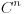
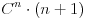
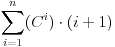

# Password-List-Generator

Generates all possible password permutations.

Runs in a unix like environment.

### Options

* Print help menu (-h)
* Generate passwords from length 1 to the specified length (-a); Overrides -L
* Calculate only estimated file size (-g)
* Do not output time statistics (-q)
* Choose maximum password length (-l <unsigned int>) (DEFAULT: 8)
* Choose minimum password length (-L <unsigned int>)
* Choose character set (-c <choice>)
* Character set options (DEFAULT: Num):
	* u (Upper case)
	* l (Lower case)
	* p (Alpha)
	* a (Alnum)
	* w (Num + Lower)
	* e (Num + Upper)
	* s (Num + Upper + Lower + Symbol)

* Choose a file to write to (-f[filename])

## Calculation

The math involved to determine how many total permutations or the total amount
of bytes used can be described by the following two expressions.

Let n be maximum password length.
Let C be character set.

Total fixed length permutations: 

Total fixed length bytes: 

Total multilength permutations: 

Total multilength bytes: 

### Limitations

1. The main limitation is time. Due to the exorbitant amount of possible passwords
for even an 8 character english alphanumeric w/ symbols creating said password
list will likely take a few years to complete.

2. A  more minor limitation is memory. An 8 character password list only using
numbers as a choice set generates about a 858MB file, as a result password
lists can become very large.

### List generation optimization

Given that I/O operations, writing to persistent memory, is the slowest
operations performed on a computing device decreasing the I/O operation time
will drastically increase password generation speed. In other words, a hard
drive with faster write speeds will make password list generation faster.

## Contribution

Anyone can contribute and work on any available issues.

Keep the same format as is used. After, simply make a pull request and have
patience.
